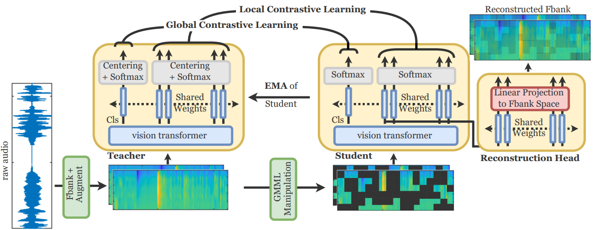

# ASiT: Audio Spectrogram vIsion Transformer for General Audio Representation



This repository contains the official PyTorch self-supervised pretraining, finetuning, and evaluation codes for 
[ASiT](https://arxiv.org/abs/2211.13189): Audio Spectrogram vIsion Transformer for General Audio Representation.

The finetuning strategy is adopted from [AST](https://github.com/YuanGongND/ast) 

# Self-supervised pre-training
> python -m torch.distributed.launch --nproc_per_node=4 --use_env main_ASiT.py --batch_size 32 --epochs 100 --data_path 'path/to/audio/files' --data-train 'path/to/json/file'

Self-supervised pre-trained models using ASiT can be downloaded from [here .. coming soon](https://drive.google.com/drive/folders/)

If you use this code for a paper, please cite:

```
@article{atito2022asit,

  title={ASiT: Audio Spectrogram vIsion Transformer for General Audio Representation},
  
  author={Atito, Sara and Awais, Muhammad and Wang, Wenwu and Plumbley, Mark D and Kittler, Josef},
  
  journal={arXiv preprint arXiv:2211.13189},
  
  year={2022}
  
}
```
